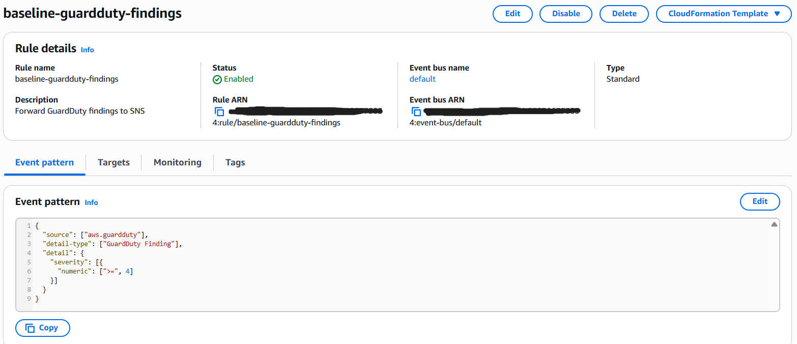
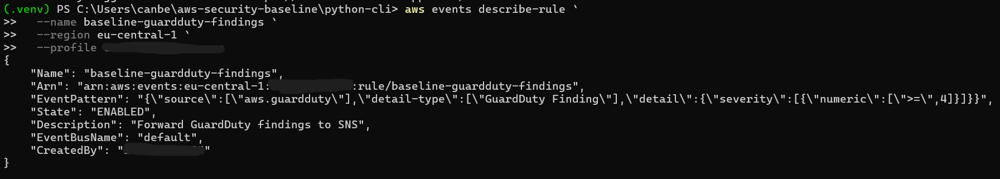
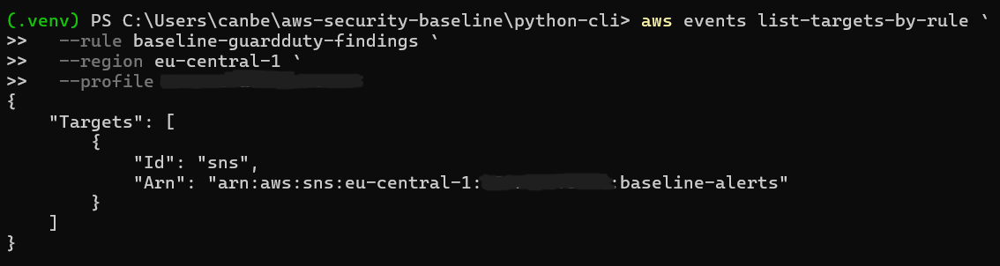
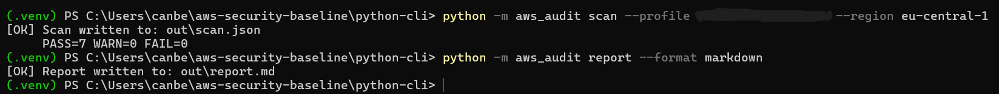
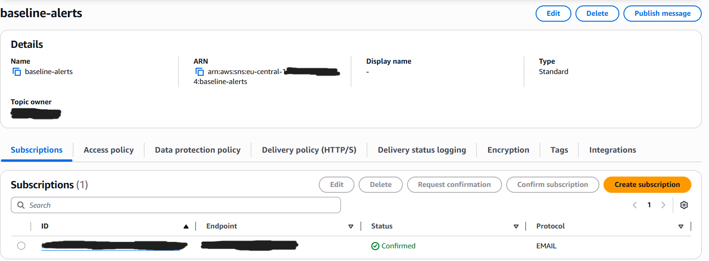
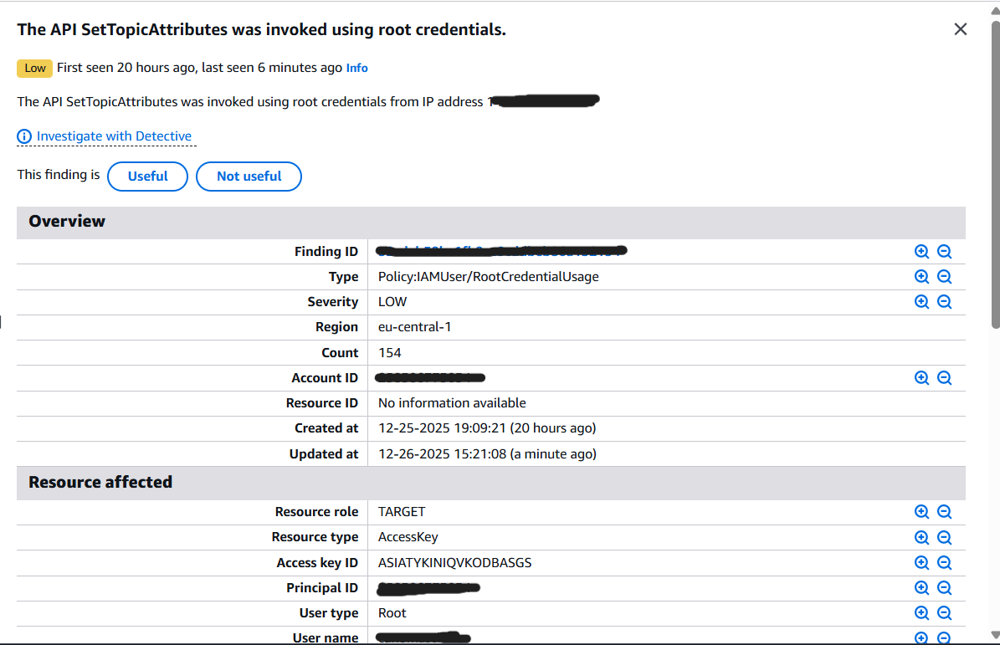
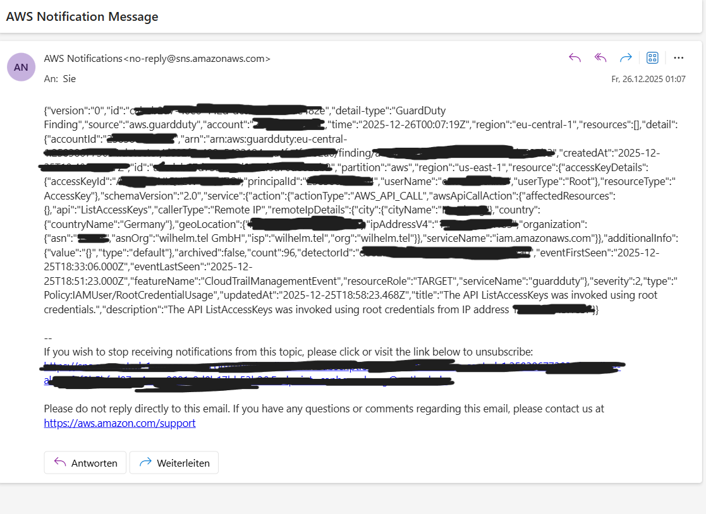

# AWS Security Baseline (Terraform + Python Audit CLI)

A small AWS security baseline that deploys core security controls (CloudTrail, GuardDuty, alerts) and verifies them via a lightweight Python audit CLI. The goal is a reproducible baseline plus evidence (screenshots) that shows the alerting pipeline end-to-end.

## What this project does

### Infrastructure (Terraform)
- Enables **GuardDuty** in the target region
- Creates an **EventBridge rule** that matches GuardDuty findings and forwards them to **SNS**
- Creates an **SNS topic** (`baseline-alerts`) with an email subscription for alert delivery
- (Optional/depending on your setup) CloudTrail + CloudWatch log group retention + alarms

### Verification (Python CLI)
A small CLI (`python -m aws_audit`) that:
- runs checks (GuardDuty enabled, CloudTrail logging, log retention, SNS topic, alarms, MFA, etc.)
- writes a machine-readable scan (`out/scan.json`)
- renders a human-readable report (`out/report.md`)

---

## Architecture

GuardDuty → EventBridge Rule → SNS Topic → Email Notification  
Plus: Python audit CLI validates that the baseline is enabled and working.

---

## Evidence (Screenshots)

### 1) EventBridge rule (GuardDuty findings → SNS)


### 2) Rule verified via CLI (describe-rule)


### 3) Rule target verified via CLI (SNS target)


### 4) Audit CLI scan + report generation


### 5) SNS topic + confirmed subscription


### 6) GuardDuty finding in the console


### 7) Alert email delivered (SNS)


---

## Prerequisites

- AWS CLI v2 configured (SSO or access keys)
- Python 3.11+ recommended
- Terraform installed (if you deploy infrastructure)
- Permissions: AdministratorAccess (or equivalent) for the demo account

---

## Quickstart

### 1) Clone & setup
```bash
git clone <your-repo-url>
cd aws-security-baseline
```

### 2) Python CLI setup
```bash
cd python-cli
python -m venv .venv
# Windows PowerShell:
.\.venv\Scripts\Activate.ps1

pip install -r requirements.txt
```

### 3) Run the audit
```bash
python -m aws_audit scan --profile <YOUR_PROFILE> --region eu-central-1
python -m aws_audit report --format markdown
```

Outputs:
- `python-cli/out/scan.json`
- `python-cli/out/report.md`

---

## Useful AWS CLI commands (verification)

EventBridge rule
```bash
aws events describe-rule \
  --name baseline-guardduty-findings \
  --region eu-central-1 \
  --profile <YOUR_PROFILE>
```

EventBridge rule targets
```bash
aws events list-targets-by-rule \
  --rule baseline-guardduty-findings \
  --region eu-central-1 \
  --profile <YOUR_PROFILE>
```

SNS: publish test message
```bash
aws sns publish \
  --topic-arn arn:aws:sns:eu-central-1:<ACCOUNT_ID>:baseline-alerts \
  --subject "baseline-alerts test" \
  --message "SNS delivery test from CLI" \
  --region eu-central-1 \
  --profile <YOUR_PROFILE>
```

---

## Notes on GuardDuty findings (sample vs real)

GuardDuty can show sample findings (prefixed with `[SAMPLE]`). This project focuses on proving the alert pipeline works end-to-end.

---

## Security / No-Secrets Policy

This repository must not contain:
- AWS access keys / secrets
- SSO cache tokens
- Terraform state files
- `.env` files
- any credential reports, raw scans, or logs that include sensitive identifiers

See `.gitignore` and the “Preflight checks before pushing” section below.

---

## `.gitignore` (important: prevents leaks)

The root `.gitignore` blocks Python virtualenvs, Terraform state, AWS/SSO caches, and generated outputs (including `python-cli/out`). Screenshots in `docs/screenshots/` remain allowed.

```gitignore
# Python
__pycache__/
*.pyc
*.pyo
*.pyd
.venv/
venv/
.env
.env.*

# Outputs / reports (can contain IDs, ARNs, account info)
**/out/
**/*.log
**/*.json
!docs/**/*.json

# AWS / SSO caches
.aws/
**/.aws/
**/sso/cache/
**/cli/cache/

# Terraform (state contains sensitive data)
**/.terraform/
**/.terraform.lock.hcl
**/terraform.tfstate
**/terraform.tfstate.*
**/crash.log
**/override.tf
**/override.tf.json
**/*_override.tf
**/*_override.tf.json
**/.terraformrc
**/terraform.rc

# OS
.DS_Store
Thumbs.db

# IDE
.vscode/
.idea/
*.iml
```

---

## Preflight checks before GitHub push (PowerShell, copy/paste)

### A) What would Git commit?
```powershell
cd C:\Users\canbe\aws-security-baseline
git init
git add -A
git status
```
If you see `terraform.tfstate`, `.aws`, `out/scan.json`, etc. → stop and clean up.

### B) Hard search for typical AWS secrets
```powershell
cd C:\Users\canbe\aws-security-baseline

# AWS Access Key IDs (AKIA..., ASIA...)
Select-String -Path . -Recurse -ErrorAction SilentlyContinue -Pattern 'AKIA[0-9A-Z]{16}|ASIA[0-9A-Z]{16}' |
  Select-Object -First 50

# "aws_secret_access_key" / "secret"
Select-String -Path . -Recurse -ErrorAction SilentlyContinue -Pattern 'aws_secret_access_key|secret_access_key|aws_session_token|BEGIN PRIVATE KEY' |
  Select-Object -First 50
```
If there are hits: open the file, remove the secret, or omit the file from the repo.

### C) Blocklist: remove Terraform state & AWS config from Git index (if staged)
```powershell
# Terraform state remove from index, keep locally
git rm -r --cached terraform.tfstate 2>$null
git rm -r --cached terraform.tfstate.backup 2>$null
git rm -r --cached .terraform 2>$null

# out/ folders remove from index
git rm -r --cached python-cli\out 2>$null
git rm -r --cached out 2>$null
```

### D) Final check
```powershell
git status
```
Only commit when `git status` is clean (code + docs + screenshots only).

---

## Codex prompt (no-leak final review)

Copy/paste into Codex or another coding agent:

```
You are a security-focused code reviewer. Your task is to prepare this repository for a public GitHub push with a strict "no secrets" policy.

Repository root (Windows): C:\Users\canbe\aws-security-baseline

Goals:
1) Identify any files that must NOT be published (credentials, tokens, AWS account artifacts, SSO cache, Terraform state, generated scan outputs).
2) Create/Update a .gitignore to block sensitive files and generated outputs.
3) Ensure the repo still contains enough artifacts to demonstrate the project (docs, screenshots, code), but no confidential data.
4) Provide a clear report:
   - What was found (file paths)
   - What actions you took/should take (delete, redact, git rm --cached)
   - What remains safe to publish

Rules:
- NEVER output secrets or tokens in the response. If you find any sensitive strings, only report the file path and the type (e.g., "AWS access key pattern").
- Prefer removing generated artifacts (e.g., python-cli/out/*, terraform.tfstate*) from version control.
- Ensure screenshots in docs/screenshots are allowed; if they contain account IDs/emails/ARNs, recommend redaction or confirm already redacted.
- After changes, show the expected clean `git status` output (only file names, no secrets).

Execute:
- List files that match these patterns: AKIA*, ASIA*, aws_secret_access_key, session_token, PRIVATE KEY, terraform.tfstate, .aws, sso/cache, out/scan.json, out/report.md
- Update .gitignore accordingly.
- Provide exact PowerShell commands for any manual cleanup needed.
```

---

## License

MIT (or choose your preferred license)
