# 🛡️ AWS Security Baseline — GuardDuty → EventBridge → SNS (Terraform) + Audit CLI (Python)

[](https://www.terraform.io/)
[](https://www.python.org/)
[](https://aws.amazon.com/)
[](https://aws.amazon.com/cloudtrail/)
[](LICENSE)

A practical, reproducible **AWS security baseline** that deploys core controls with **Terraform** and verifies them with a lightweight **Python audit CLI**.

✅ **Goal:** prove the full security signal pipeline works end-to-end — including **real alert delivery** — and document it with evidence.

Single-account demo (examples use `eu-central-1`).

---

## Project overview

This repository builds an AWS security alert pipeline and verifies that it works end-to-end.

Terraform deploys GuardDuty, EventBridge, and SNS, plus logging/alerting components (CloudTrail, CloudWatch Logs, retention, alarms).

The Python audit CLI verifies the setup and generates a report.

This is about more than creating resources — it’s about proving that findings are routed correctly and alerts actually arrive.

### What it does

- Enables **GuardDuty** in the selected region.
- Creates an **EventBridge rule** that matches GuardDuty findings.
- Forwards matching events to an **SNS topic** (`baseline-alerts`).
- Delivers notifications to an **email subscription** (after subscription confirmation).
- Enables **CloudTrail** and sends logs to **CloudWatch Logs** (including retention settings and basic alarms).
- Optional: enables **AWS Config** and applies **S3 public read/write** managed rules.

### Verification (Python audit CLI)

After `terraform apply`, run:

- `python -m aws_audit scan` to validate the key controls and wiring
- `python -m aws_audit report --format markdown` to generate a readable report

Outputs:
- `python-cli/out/scan.json`
- `python-cli/out/report.md`

The **Evidence** section includes console/CLI screenshots and an example SNS email to show alert delivery.

### Scope / non-goals

This repo is intentionally scoped to a **single AWS account** and **one region** to keep deployment and verification reproducible. Organization-wide multi-account setups (AWS Organizations / delegated admin) and full landing zone patterns are out of scope for this repo.

---

## 🧭 Architecture

### Diagram (renders on GitHub)

```mermaid
flowchart LR
  GD[🛡️ GuardDuty Findings] --> EB[📡 EventBridge Rule]
  EB --> SNS[📣 SNS Topic: baseline-alerts]
  SNS --> EMAIL[✉️ Email Subscription]

  CLI[🧪 Python Audit CLI] -. validates .-> GD
  CLI -. validates .-> EB
  CLI -. validates .-> SNS
```



### Components (official docs)

- 🛡️ [GuardDuty](https://aws.amazon.com/guardduty/)
- 📡 [EventBridge](https://aws.amazon.com/eventbridge/)
- 📣 [SNS](https://aws.amazon.com/sns/)
- 🧾 [CloudTrail](https://aws.amazon.com/cloudtrail/)
- 🧪 [AWS Config](https://aws.amazon.com/config/)

---

## 📸 Evidence — end-to-end proof (screenshots)

**Preview:** end-to-end alert delivery (SNS → Email)

<p align="center">
  
</p>

<details>
<summary>Show screenshots</summary>

> Tip: These are **clickable thumbnails**. Click to open the full-size image.

<p align="center">
  <a href="docs/screenshots/01-eventbridge-guardduty-rule.png"></a>
  <br/>
  <sub><b>01</b> — EventBridge rule: GuardDuty findings → SNS</sub>
</p>

<p align="center">
  <a href="docs/screenshots/02-eventbridge-rule-cli.png"></a>
  <br/>
  <sub><b>02</b> — Verified via CLI: <code>aws events describe-rule</code></sub>
</p>

<p align="center">
  <a href="docs/screenshots/03-eventbridge-sns-target-cli.png"></a>
  <br/>
  <sub><b>03</b> — Verified target via CLI: SNS is attached to the rule</sub>
</p>

<p align="center">
  <a href="docs/screenshots/04-security-audit-cli.png"></a>
  <br/>
  <sub><b>04</b> — Audit CLI: scan + markdown report generation</sub>
</p>

<p align="center">
  <a href="docs/screenshots/05-sns-topic-subscription.png"></a>
  <br/>
  <sub><b>05</b> — SNS topic + confirmed email subscription</sub>
</p>

<p align="center">
  <a href="docs/screenshots/06-guardduty-finding-console.png"></a>
  <br/>
  <sub><b>06</b> — GuardDuty finding in AWS Console</sub>
</p>

</details>

---

## ✅ Quickstart

### 1) Clone

```bash
git clone https://github.com/Cann65/aws-security-baseline.git
cd aws-security-baseline
```

### 2) Deploy infrastructure (Terraform)

```bash
terraform -chdir=terraform init
terraform -chdir=terraform apply -var="alert_email=YOUR_EMAIL"
```

> After `apply`: confirm the SNS subscription email (required for alert delivery).

### 3) Run the audit (Python)

> Replace `<PROFILE>` with your AWS CLI profile (examples use `eu-central-1`).

```bash
cd python-cli
python -m venv .venv
# Activate venv (choose your OS):
# Windows PowerShell:
.\.venv\Scripts\Activate.ps1
# Linux/macOS:
source .venv/bin/activate

pip install -r requirements.txt

python -m aws_audit scan --profile <PROFILE> --region eu-central-1
python -m aws_audit report --format markdown
```

### 4) Destroy when done

```bash
terraform -chdir=terraform destroy -var="alert_email=YOUR_EMAIL"
```

### Costs to expect

GuardDuty, CloudTrail, CloudWatch Logs, and SNS all incur AWS charges while enabled. Keep runs short-lived and destroy the stack when finished.

---

## 🔎 Useful AWS CLI checks

### EventBridge — rule

```bash
aws events describe-rule \
  --name baseline-guardduty-findings \
  --region eu-central-1 \
  --profile <PROFILE>
```

### EventBridge — targets

```bash
aws events list-targets-by-rule \
  --rule baseline-guardduty-findings \
  --region eu-central-1 \
  --profile <PROFILE>
```

### SNS — test publish

```bash
aws sns publish \
  --topic-arn arn:aws:sns:eu-central-1:<ACCOUNT_ID>:baseline-alerts \
  --subject "baseline-alerts test" \
  --message "SNS delivery test from CLI (eu-central-1)" \
  --region eu-central-1 \
  --profile <PROFILE>
```

---

## 🔐 Security / No‑Secrets Policy

This repo is designed to be public. It must **never** contain:

- access keys / secret keys / session tokens
- SSO cache
- Terraform state files
- generated audit outputs

**Required:** keep these paths out of Git:

- `**/terraform.tfstate*`
- `**/.terraform/`
- `**/.aws/` and `**/sso/cache/`
- `python-cli/out/`
- `**/*.tfvars` and `.env*`

Covered by `.gitignore`, so these are already excluded from commits (double-check before pushing).

---

## Next improvements (ideas)

- Add Slack/Teams notifications (SNS → Lambda → webhook)
- Add multi-account support (Organizations / delegated admin) as a separate module
- Add a CI job to run the audit CLI in read-only mode

---

## What this demonstrates

- AWS-native detection & alerting (**GuardDuty + EventBridge + SNS**)
- Infrastructure as Code (**Terraform**) with reproducible deployments
- Verification-driven security (**audit CLI**)
- Evidence-driven delivery (**console + CLI + delivered email**)

---

## 📄 License

MIT — see `LICENSE`
